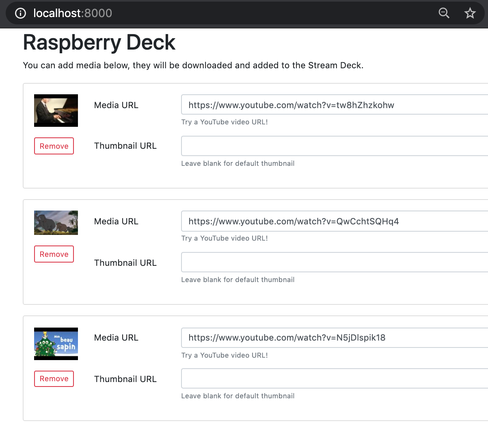

# Raspberry Deck

This is the code for a screen-less music player for kids, powered by an [Elgato Stream Deck](https://www.amazon.com/Elgato-Stream-Deck-Controller-customizable/dp/B06XKNZT1P) connected to a [Raspberry Pi](https://www.raspberrypi.org/) or any other computer with Python 3.5+, a sound card and an USB port.

It features a simple web interface capable of mapping media URLs (Youtube and [many others](http://ytdl-org.github.io/youtube-dl/supportedsites.html)) to StreamDeck buttons:



Other features:
 - Custom thumbnails
 - Offline play (you only need to be online to download the media after adding them in the UI)
 - Pagination
 - Interrupt currently playing media by holding the page button for 3+ seconds

## Setup on macOS

First, install [VLC](http://www.videolan.org/) if for some reason you don't already have it.

Then clone this repository and run (ideally in a Python virtualenv):

```
$ brew install hidapi
$ make deps
$ make run
```

## Setup on Debian / Raspbian

Clone this repository and run (ideally in a Python virtualenv):

```
$ apt-get install libhidapi-libusb0 libvlc5 vlc
$ make deps
$ make run
```

Then you have to run `make linuxsetup` to give unprivileged users access to raw USB commands needed for connecting to a streamdeck.

On Raspberry Pi, you have to make sure you are using the jack as audio output and not the HDMI audio out. See instructions at https://www.raspberrypi.org/documentation/configuration/audio-config.md


## TODO:

 - Test other sources than YouTube
 - Add a couple locks for playback
 - More status in frontend: current playing, download status, cache size
 - Reset cache button
 - CLI args support
 - Download thread
 - Loading progress indicators
 - Config minimum play time / restrictions
 - prebuild rpi image / howto
 - clean shutdown
 - logs in frontend
 - remote kill switch
 - deck-less with web interface?
 - frontend htaccess
 - better defensive programming
 - config via the frontend / storage of config
 - time limits / screen time
 - Better design
 - Folders
 - Start/Stop time offsets + edition
 - Test small & xl streamdecks
 - Fetch audio + metadata in single youtube-dl pass
 - YT search in frontend?
 - docker image
 - linting
 - publish on pypi?
 - physical build tutorial & photos
